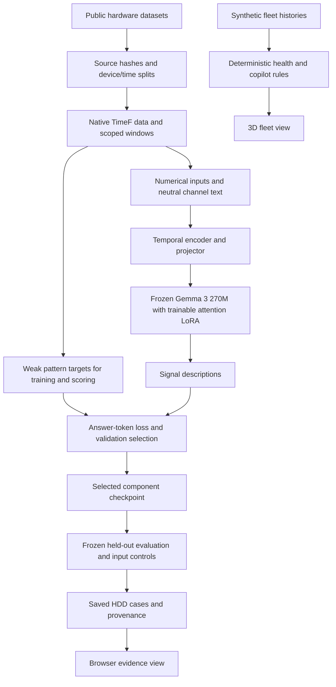

# Canary

**Describe hardware signal changes with small time-series language models. Inspect the measurements behind each answer.**

Canary is a research prototype built by team Piloty for the EHL Zurich Temporal AI Challenge. We prepared public hardware datasets, fine-tuned Gemma-based OpenTSLM models, and built an inspection demo.

Thirteen component models passed their declared signal-description checks. The strongest result is **99.68% channel accuracy on 2,048 unseen HDDs**, compared with 69.43% for an all-constant baseline. These scores measure agreement with numerical pattern rules. Failure prediction and maintenance benefit remain unvalidated.

The project was previously called DriftOps. Package names, commands, and directories retain `driftops` for compatibility.

[Quick start](#quick-start) · [Architecture](#architecture) · [Results](#results) · [Reproduction](#reproduce-the-results) · [Limitations](#limitations-and-next-work) · [Licenses](#licenses-and-attribution)

## Why we built it

Hardware operators need to understand how measurements change over time. A current temperature or error count does not describe the preceding weeks. Our question was whether a small language model could read numerical histories and produce useful signal descriptions.

We started with HDDs because Backblaze publishes daily drive measurements with device identities and dates. This supports tests on unseen drives and later periods. We then trained separate models for storage, compute, cooling, and industrial components.

We chose a narrow task with inspectable answers. Numerical rules provide reference descriptions such as `constant`, `rising`, `falling`, and `counter reset or decrease`. This lets us test whether model answers depend on the supplied measurements. It does not replace evaluation against real faults or technician judgments.

The demo explores how an operator could navigate a fleet, inspect a component, and review its evidence. Its saved HDD cases connect real measurements to recorded model answers. Its synthetic fleet illustrates a possible operator workflow.

## What we built

| Part | Implemented behavior | Evidence boundary |
| --- | --- | --- |
| Dataset pipeline | Source inventories, checksums, device/time splits, native TimeNet/TimeF preparation, and input-boundary checks | Public measurements and rule-derived training targets |
| Component models | Separate OpenTSLM fine-tunes, validation selection, frozen test protocols, controls, and checkpoint reload | Signal descriptions for each declared study |
| Saved HDD evidence | Three real 28-day windows, raw charts, exact saved answers, reference labels, and provenance | Saved inference, including one model mistake |
| 3D fleet demo | 147 illustrative devices, site/rack navigation, component inspection, timeline, incidents, and copilot | Synthetic telemetry and deterministic rules |
| Backblaze preview | Browser inspection of development windows from the bundled pilot | Real measurements with deterministic descriptions |

Neither browser application runs fresh trained-model inference. The 3D fleet's risk numbers, maintenance suggestions, and projections are illustrative. Real HDD cases leave failure probability, failure window, and confidence unavailable.

## Quick start

### Run the inspection demo

The server uses the Python standard library. No GPU, model download, or cloud account is required. Use a modern Python 3 installation and a browser with WebGL support. The browser needs network access for Three.js and fonts.

From a copy of this revision, run:

```bash
cd EHL_Zurich_hackathon_team_piloty
python3 driftops3d/server.py --host 127.0.0.1 --port 8765
```

Open <http://127.0.0.1:8765/#/evidence/hdd-rising> for the real HDD evidence. Select **Stable control** or **Model mismatch** to inspect the other cases.

Open <http://127.0.0.1:8765/#/site/site-a> for the synthetic fleet. Initial fleet preparation usually takes about 15 seconds. Select a rack, select a device, then select **Analyze** to inspect its components. Stop the server with `Ctrl+C`.

See [the demo guide](driftops3d/README.md) for navigation, API routes, browser checks, and optional local telemetry collection. Local telemetry collection does not connect a device to the trained HDD model.

### Build the real Backblaze pilot

Use Linux, Python 3.12 or newer, and `uv` for the locked data and model environment. Run all commands below from the repository root.

```bash
uv sync --locked
uv run --no-sync driftops prepare
uv run --no-sync driftops demo
```

Open <http://127.0.0.1:8000>. Preparation verifies the bundled source checksum, builds native TimeF data, and checks the stored data against the source. Repeated preparation verifies and reuses the existing dataset version.

The bundled sample is about 1.2 MB. It contains 547,812 observations from 3,000 HDDs during July through December 2024. Preparation produces 13,616 signal-description tasks across the splits. The preview exposes 7,151 training tasks. This small pilot differs from the full-history training dataset.

If you develop with an agent, use `bash scripts/bootstrap.sh` after installing Entire and `uv`. The bootstrap enables Entire, installs training dependencies, prepares the pilot, and runs tests. Keep Entire recording and its normal Git push hook active to preserve the hackathon history.

## Architecture

The implemented stack uses Python, TimeNet/TimeF, DuckDB, Parquet, PyTorch, and OpenTSLM. The demo uses Python's HTTP server, vanilla JavaScript, and Three.js.



### Data and model boundaries

The HDD model receives up to four complete SMART channels over 28 consecutive days: `smart_5_raw`, `smart_187_raw`, `smart_194_raw`, and `smart_197_raw`. Each eligible full-history window contains at least two complete channels.

The adapter normalizes each channel within its observed window. Successful training runs also supply that window's raw standard deviation in the channel text. This retains scale information needed by the reference rules. No fitted normalization uses validation or test data.

The temporal encoder converts numerical sequences into embeddings. The projector maps them into Gemma's embedding space. OpenTSLM combines these embeddings with neutral text and generates one pattern description per channel.

Training updates the encoder, projector, and rank-8 attention LoRA. Original Gemma parameters stay frozen. Each final model has 271,029,888 parameters, of which 2,931,072 are trainable. Each component starts from the pinned upstream model, not another component's fitted weights.

The training wrapper masks prompt and padding tokens from the loss. Its input allowlist excludes targets, device identities, absolute dates, failure flags, and future observations. Checkpoint selection uses validation data before the controller releases test inputs.

The model pins are in [config/model.yaml](config/model.yaml). The implemented loader and input boundary are in [opentslm.py](src/driftops/opentslm.py). The earlier [architecture proposal](docs/architecture.md) describes additional risk and operator services that remain proposed.

## Results

The table reports the frozen September 13, 2026 evaluations. Channel accuracy measures correct pattern labels across supplied channels. Macro F1 averages F1 over supported classes. Groups are independent devices, machines, or households, as defined by each study.

| Component | Test groups | Channel accuracy | All-constant baseline | Zero-input accuracy | Macro F1 | Gate |
| --- | ---: | ---: | ---: | ---: | ---: | --- |
| HDD | 2,048 | 99.68% | 69.43% | 86.01% | 0.9912 | Passed |
| SSD | 159 | 95.91% | 0.31% | 24.53% | 0.9512 | Passed |
| NVMe | 256 | 97.75% | 47.66% | 57.42% | 0.9443 | Passed |
| DRAM | 256 | 94.14% | 33.59% | 78.12% | 0.9195 | Passed |
| CPU | 256 | 81.45% | 0.00% | 63.48% | 0.7597 | Passed |
| GPU | 256 | 92.32% | 7.42% | 80.08% | 0.9047 | Passed |
| Server power | 256 | 83.01% | 0.00% | 48.24% | 0.8344 | Passed |
| Fan | 116 | 95.69% | 9.05% | 49.14% | 0.9651 | Passed |
| Gearbox | 5 | 86.91% | 0.00% | 36.76% | 0.8716 | Passed |
| Generator bearing | 5 | 93.20% | 0.00% | 36.21% | 0.9331 | Passed |
| Gear-oil pump | 5 | 82.11% | 0.00% | 27.15% | 0.8113 | Passed |
| Slide-rail sound | 5 | 83.22% | 0.00% | 35.60% | 0.8324 | Passed |
| Industrial-valve sound | 5 | 77.08% | 0.00% | 49.34% | 0.7579 | Passed |
| Radiator valve | 5 | 95.10% | 64.51% | 93.36% | 0.8134 | Failed |

Source: [measured metrics](results/2026-09-13/measured-metrics.json), [run catalog](results/2026-09-13/model-catalog.json), and [component results](docs/component-model-results.md). Each run retains its own protocol, baselines, raw predictions, and gate checks.

### What the checks establish

All thirteen passing models beat the starting checkpoint and all-constant baseline under their frozen criteria. They also passed numerical-input, reversal, shuffle, output-validity, and exact GPU reload checks. The zero-input control replaces numerical sequences with zeros while retaining the text. It measures the benefit of the numerical input under that control.

The constant baseline is weak when few test labels are constant. The starting checkpoint's strict score also reflects invalid answer formatting. The deterministic reference rules score 100% because they created the targets. These comparisons do not show that a language model outperforms the rules on this task.

The HDD test contains 2,048 windows from 2,048 unseen drives and 6,777 channel labels. Exact-window accuracy is 98.93%. The selected checkpoint completed one pass through all 11,315,069 eligible training windows from 260,618 drives. Training used eight Nebius RTX PRO 6000 GPUs.

The final project ledger estimated $111.35 spent under the $600 ceiling, including setup, training, evaluation, and storage. This is a historical estimate, not an invoice or a reproduction price. See [the full-history report](docs/full-history-training.md) for the run and compute records.

### Negative results and study limits

The initial CPU concept produced the same answer for all 64 test windows, even with zeroed numerical input. Its 77.7% channel accuracy failed the useful-input-dependence check. The successful HDD run started from upstream weights. See [the concept evaluation](docs/evaluation.md).

The dated radiator-valve model failed its original gate because one household lacked sufficient changed-target support. An unchanged-weight follow-up also failed numerical dependence across groups. The separate industrial-valve sound result does not turn either telemetry failure into a pass.

The dated industrial tests contain 1,280 windows but only five independent groups each. Each sound test contains 5,120 windows across five machines. Sound acquisition dates are unknown. Those studies enforce separate machines but cannot establish chronological generalization. Calibration partitions remain unused.

All selected models reproduced sixteen saved predictions on the same GPU hardware. CPU checks matched sixteen for ten categories. CPU, GPU, server-power, and dated radiator-valve models matched fifteen of sixteen. Exact answers across hardware are therefore not guaranteed.

## Reproduce the results

The repository includes a runnable pilot and compact evaluation evidence. Selected weights and full evaluation inputs use release assets. Large raw datasets require separate publisher downloads.

The `v2026.09.13` source release predates the local Canary evidence-view updates described here. Use this revision for the demo and that release for the recorded experiment artifacts.

### 1. Verify the committed evidence

This requires no model download or training:

```bash
(cd results/2026-09-13 && sha256sum -c SHA256SUMS)
```

The [evidence index](results/2026-09-13/README.md) maps the files. It contains fifteen evaluated runs and fourteen distinct selected checkpoints. The radiator-valve follow-up reused the original weights.

### 2. Replay a released model on CPU

This example checks sixteen saved SSD predictions. It does not update weights. Install GitHub CLI `gh` for release downloads. If repository access requires authentication, sign in locally with `gh auth login`.

First, install the locked CPU environment:

```bash
uv sync --locked --extra training --extra model-access
```

Next, complete Hugging Face access for the pinned Gemma model under its terms. Authenticate through the local CLI and download both dependencies:

```bash
uv run --no-sync hf auth login
uv run --no-sync hf download google/gemma-3-270m \
  --revision 9b0cfec892e2bc2afd938c98eabe4e4a7b1e0ca1
uv run --no-sync hf download OpenTSLM/gemma-3-270m-tsqa-sp model_checkpoint.pt \
  --revision c97bd36131e07d53a7af9cd307eb3db628f9712f
```

Keep credentials in the CLI's local credential store. The model loader requires cached files at these exact revisions.

Download the SSD checkpoint, evaluation archive, and checksums into a new directory:

```bash
mkdir -p artifacts/github-release/v2026.09.13
gh release download v2026.09.13 \
  --repo M-10001/EHL_Zurich_hackathon_team_piloty \
  --dir artifacts/github-release/v2026.09.13 \
  --pattern ssd-component-v1-model.tar.gz \
  --pattern evaluation-evidence.tar.gz \
  --pattern SHA256SUMS
(cd artifacts/github-release/v2026.09.13 && sha256sum --ignore-missing -c SHA256SUMS)
```

After the checks pass, extract into a checkout without existing experiment artifacts. Archive paths restore the original `artifacts/tslm/` layout.

```bash
tar -xzf artifacts/github-release/v2026.09.13/ssd-component-v1-model.tar.gz
tar -xzf artifacts/github-release/v2026.09.13/evaluation-evidence.tar.gz
```

Run the comparison from the repository root:

```bash
uv run --no-sync python - <<'PY'
import json
from pathlib import Path

import torch
from driftops.full_archive import file_hash
from driftops.opentslm import generate, load_model
from driftops.tslm_dataset import input_hash

run = Path("artifacts/tslm/ssd-component-v1")
receipt = json.loads(Path("results/2026-09-13/cpu-reload/ssd-component-v1.json").read_text())
assert file_hash(run / "best.pt") == receipt["checkpoint_sha256"]
examples = json.loads((run / "evaluation/test.json").read_text())[:16]
inputs = [{"inputs": item["inputs"]} for item in examples]
assert [input_hash(item["inputs"]) for item in inputs] == receipt["input_hashes"]

torch.set_num_threads(8)
model = load_model("cpu", checkpoint=run / "best.pt")
answers = generate(model, inputs, max_new_tokens=128)
matches = sum(a == b for a, b in zip(answers, receipt["gpu_outputs"]))
print(f"Saved GPU answers reproduced: {matches}/16")
assert len(answers) == 16 and matches == 16
PY
```

Expected output: `Saved GPU answers reproduced: 16/16`. This checks checkpoint reload and saved predictions, not a new benchmark. The preceding hardware caveats still apply.

The SSD model archive is about 548 MB. Each selected checkpoint is about 683 MB before compression. Checkpoints also contain Gemma embedding and output-head tensors, so they are not small pure adapters. They still require the pinned base model and this repository's code. See [the release guide](docs/project-release.md) for all fourteen checkpoints.

### 3. Rebuild datasets and repeat training

The full HDD experiment covers the 44 acquired archives through Q1 2026. Its inventory contains about 30.8 GiB of ZIP files and 229.6 GiB of CSV content before preparation. Prepared data needs additional storage.

For the recorded HDD cohort, start with the committed inventory instead of discovering a newer archive list. Use a checkout without existing full-history data:

```bash
mkdir -p data/backblaze-full
cp results/2026-09-13/backblaze/inventory.json data/backblaze-full/inventory.json
uv run --no-sync python -m driftops.full_archive download
uv run --no-sync python -m driftops.full_prepare
uv run --no-sync python -m driftops.full_dataset
```

Compare downloaded hashes and preparation totals with the [recorded Backblaze receipts](results/2026-09-13/backblaze/). Stop if the publisher's files differ from the recorded inputs.

The [full-history configuration](config/full_history.yaml) fixes these device-disjoint periods:

| Partition | Complete input-window dates | Eligible windows | Devices |
| --- | --- | ---: | ---: |
| Training | January 2013 through December 2024 | 11,315,069 | 260,618 |
| Validation | January through September 2025 | 422,976 | 49,668 |
| Calibration reserve | January through September 2025 | 279,283 | 32,815 |
| Test | October 2025 through March 2026 | 295,377 | 50,886 |

These totals describe the prepared dataset. The recorded HDD evaluation uses a fixed subset of 2,048 test drives. Input windows exclude recorded failures and later observations.

For other components, follow [the component preparation and training program](docs/component-training-program.md). The [dataset audit](docs/component-dataset-audit.md) records sources, channels, chronology, rejected alternatives, and terms. The industrial and sound studies have their own fixed designs.

Full retraining requires a separately configured CUDA environment and bounded compute. The CPU `training` extra and CUDA `nebius-training` extra are mutually exclusive. Use `uv sync --locked --extra nebius-training` only on the training host.

The [HDD run guide](docs/full-history-training.md), [training configuration](config/train_full.yaml), and [per-run records](results/2026-09-13/runs/) preserve the experiment settings. The small [CPU training guide](docs/training.md) reproduces the earlier concept experiment, not the successful full-history model.

Cloud orchestration retains hackathon-specific paths, budget checks, and expired deadlines. It requires a fresh compute ledger, valid resource configuration, and a tested provider stop guard. It is not an unattended one-command reproduction path.

Before each training run, write and explain its objective, data splits, updated and frozen parameters, hardware, cost cap, stopping rules, evaluation, and outputs. Use a new run directory. Preserve the released checkpoints and test results. Retraining can vary with hardware and execution order, so retain new predictions and report differences.

## Repository map

| Path | Purpose |
| --- | --- |
| [`src/driftops/`](src/driftops/) | Data adapters, TimeNet connector, model bridge, training, evaluation, and preview CLI |
| [`src/driftops/_vendor/opentslm/`](src/driftops/_vendor/opentslm/) | Pinned OpenTSLM subset with provenance and upstream notices |
| [`driftops3d/`](driftops3d/) | Demo server, telemetry collector, rule analysis, and Three.js application |
| [`config/`](config/) | Dataset contracts, source catalogs, model pins, and training settings |
| [`examples/backblaze-pilot/`](examples/backblaze-pilot/) | Bundled public pilot and source manifest |
| [`results/2026-09-13/`](results/2026-09-13/) | Versioned metrics, protocols, checksums, model catalog, and demo cases |
| [`scripts/`](scripts/) | Bootstrap, downloads, compute controls, and artifact export |
| [`tests/`](tests/) | Data boundaries, native TimeF checks, training math, evaluation, and compute-control tests |
| [`docs/`](docs/) | Experiment reports, study designs, handoff, and proposals |

Raw archives, prepared datasets, model weights, caches, and credentials remain outside Git. Release archives carry the selected model weights and complete evaluation JSON.

## Development checks

From the repository root:

```bash
uv sync --locked --extra training --extra model-access
uv run --no-sync driftops prepare
uv run --no-sync pytest -q
python3 -m unittest discover -s driftops3d/tests -p 'test_*.py' -v
```

The main pytest configuration only discovers `tests/`. Run the separate demo tests as shown. Prepare the pilot first so the real-data integration test can run. Browser checks require Playwright and a supported browser. See [the demo verification instructions](driftops3d/README.md#evidence-and-replay-checks).

Keep changes scoped and preserve the source, split, and checkpoint hashes in released evidence. New studies need new run directories and an untouched test cohort. Use [the handoff](docs/handoff.md) for development context and [the implementation plan](docs/implementation-plan.md) for remaining work.

## Limitations and next work

Canary is a research prototype. The current evidence supports descriptions of observed patterns within the declared studies.

- Labels come from rules. Independent technician review, fault diagnosis, failure lead time, and maintenance outcomes remain unmeasured.
- The natural HDD test has no counter-reset labels. Missing DRAM error logs do not establish healthy operation.
- Small industrial studies have only five test groups. Sound studies have unknown chronology and no calibration fit.
- The three displayed HDD cases were selected after evaluation. They illustrate behavior and errors, not aggregate performance.
- Live model inference, calibrated failure risk, and outcome-based maintenance evaluation remain future work.
- The demo server is a local prototype. Authentication, deployment hardening, and operational monitoring require separate work before public service deployment.

The next product step is to connect live model inference to the evidence contract. Subsequent work should evaluate alert quality and maintenance outcomes on independent data.

## Presentation

- [Eight-slide Canary presentation](PresentationDraftDeck.html)
- [Submission PDF](Canary-Presentation.pdf)
- [Five-minute speaker script and sources](docs/canary-presentation.md)
- [Presentation research and technical appendix](docs/reviews/2026-09-13/presentation-plan.md)

## Licenses and attribution

We built on Aionic TimeNet, OpenTSLM, Google Gemma, and Nebius compute. The dataset providers made the experiments possible. The [dataset attribution file](docs/licenses/DATASET-ATTRIBUTION.md) records authors, versions, and preparation changes.

Model weights, vendored code, and datasets have separate terms. Read [the model and dataset license guide](docs/model-licenses.md) and retain the accompanying notices. The recorded release limits DRAM and sound checkpoints to noncommercial research and evaluation.

This revision does not include a project-wide source-code license. The team still needs to choose one for its original code before describing the whole repository as open source. Upstream notices do not supply a license for all project code.
