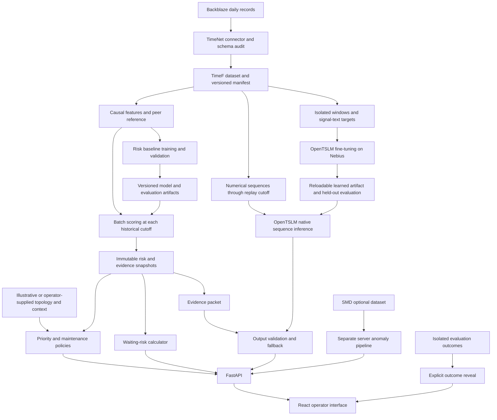

# DriftOps technical architecture

Your infrastructure doesn't fail suddenly. It drifts.

**Status:** proposed implementation, 12 September 2026. This repository currently contains planning documents, not a trained model or working application. All thresholds, schedules, and examples below are design choices to validate, not experimental results.

Build one complete path: **drive history → temporal evidence → estimated risk → operational priority → maintenance decision → held-out outcome reveal**. Storage is the measured implementation; server and rack views provide navigation and explicitly illustrative context.

The companion [implementation plan](implementation-plan.md) defines work **by Codex alone, with no delegation**, starting each step when its prerequisites are satisfied. **TimeNet data preparation, OpenTSLM training or fine-tuning, and held-out TSLM evaluation are required.** The initial 3,000-drive Backblaze TimeF pilot is built. Nebius CLI access and GPU quota are verified; remaining credit balance, GPU capacity, and model loading remain to be checked. Gemma 3 270M and its matching OpenTSLM-SP checkpoint are now selected with verified weight access, while Llama access review continues independently. The user confirmed a **$600** voucher and requires an overview before every training run. A hosted inference endpoint is optional when the trained model can be served locally or on Nebius.

The required deliverable is a TimeNet-prepared storage dataset with signal-text targets, a trained OpenTSLM checkpoint or learned adapter, evaluation against baselines, and a real replay with evidence, model findings, and maintenance decisions. Calibrated risk and survival curves depend on outcome support. Reliable failure-time intervals, SMD, historical-neighbor retrieval, and transfer experiments remain optional or deferred. Missing training, model, or data requirements must be reported as incomplete, never disguised by simulated results.

## 1. Design decisions

| Decision | Implementation | Reason |
|---|---|---|
| Numerical predictions have a dedicated owner | Statistical risk service; OpenTSLM owns sequence interpretation | Every number can be evaluated independently of the explanation |
| Prepare data through TimeNet | Reusable connector, TimeF dataset, explicit metadata/annotations/targets | Meet the challenge's data requirement and make ingestion reusable |
| Train the signal-language task | Fine-tune OpenTSLM on causal SMART-window descriptions and evaluate against its starting checkpoint and rule descriptions | Submit learned weights and measure the TSLM itself |
| Start with a measurable baseline | XGBoost on causal rolling features; compare against current-value features and a fixed SMART rule | Establish whether history adds value before adding complexity |
| Model the maintenance horizons explicitly | Seven-day classifier first; daily hazard curve after core requirements and sufficient validation | A single probability cannot supply a failure-time distribution |
| OpenTSLM receives numerical signals | Native sequence adapter plus evidence validation and deterministic recommendation rendering | Make the required model integration substantive and inspectable |
| Replay uses an explicit historical clock | One `as_of` snapshot propagated through every service | Prevent hidden future data from entering predictions or explanations |
| Keep deployment small | One Python API, one React frontend, local artifacts | Fits a weekend and can run without cloud infrastructure |
| Track provenance at field level | Observed, derived, operator-supplied, illustrative, unavailable | Real SMART data and invented topology must remain distinguishable |

## 2. Architecture and execution paths



**Offline:** build/read TimeNet data, assign drive/time splits, prepare isolated language targets, fit baseline models, fine-tune OpenTSLM, evaluate each on its declared task, calibrate risk where supported, and export learned artifacts and snapshots. Training does not run during a demo request. Future labels belong only to the training-target/evaluation path; serving exports contain input-only histories and evidence.

**Interactive:** selecting a drive and replay time loads a versioned snapshot. Priority and simulation operate on that snapshot plus a context version. OpenTSLM receives the corresponding numerical sequences, neutral channel metadata, and question. The evidence packet supports server-side validation and final explanation assembly, without supplying target descriptions to the model. Changing the replay time invalidates all four views together. Local model inference uses a single resident worker; API requests must not create duplicate GPU model instances.

**Outcome reveal:** failure dates live in a separate evaluation artifact and route. They never appear in the ordinary detail response, copilot context, or client preload. Resetting replay clears the revealed outcome and subsequent conversation.

## 3. Proposed stack

| Layer | Choice | Boundary |
|---|---|---|
| Data preparation | Python, TimeNet/TimeF, DuckDB, Parquet | Reusable ingestion and dataset card; batched source reads; derived runtime tables |
| Modeling | OpenTSLM/PyTorch on Nebius plus XGBoost and scikit-learn | Required TSLM fine-tuning and evaluation; separate CPU prediction baseline |
| API | FastAPI with Pydantic | Typed contracts, snapshot lookup, simulation, copilot validation |
| Frontend | React, TypeScript, Vite, Recharts | Fleet table, history chart, evidence, simulator, replay |
| Local persistence | Parquet/JSON artifacts; SQLite for maintenance drafts | API reads frozen analytical artifacts; operator changes are separate |
| Verification | pytest and browser flow checks | Temporal correctness, numerical invariants, and the complete operator journey |

DuckDB can query Parquet directly and push projections and filters into scans; this supports a small local data pipeline. FastAPI supplies Pydantic-based validation and OpenAPI contracts. [DuckDB documentation](https://duckdb.org/docs/lts/data/parquet/overview), [FastAPI documentation](https://github.com/fastapi/fastapi/blob/master/docs/en/docs/features.md).

Pin exact tested dependencies when implementation starts. The inspected machine has Python 3.10.8, Node 20.15.1, and an NVIDIA GeForce RTX 3060 Laptop GPU with 6,144 MiB VRAM. These are observed resources, not evidence that inference fits. OpenTSLM's current project metadata requires Python 3.12 or newer; current Vite also requires a newer Node runtime. Set up compatible project runtimes in the first implementation checkpoint. No runtime upgrade or model download has been performed. [OpenTSLM project metadata](https://github.com/OpenTSLM/OpenTSLM/blob/main/pyproject.toml), [Vite requirements](https://vite.dev/guide/).

## 4. Data boundaries

### Storage dataset

Backblaze publishes daily CSV snapshots with drive identifiers, model information, and raw/normalized SMART attributes. Schemas can change between quarters. Audit each selected archive and retain its schema and source attribution in a manifest. [Backblaze dataset](https://www.backblaze.com/cloud-storage/resources/hard-drive-test-data).

The initial candidate fields are `date`, `serial_number`, `model`, `capacity_bytes`, `failure`, and available SMART 5, 9, 187, 188, 194, 197, and 198 raw/normalized columns. Preserve source names until a model-specific mapping verifies their meaning. Packed raw values and vendor-specific encodings must not be treated as universal physical counts.

Backblaze's published definition includes both stopped drives and drives removed because they showed signs of impending failure. Therefore the supervised endpoint is **a recorded failure event under the source fleet's operating policy**. It is not a verified service outage, data-loss event, or untouched mechanical lifetime. [Backblaze failure definition](https://www.backblaze.com/blog/hard-drive-smart-stats/).

The ingestion audit must explicitly identify available metrics. Latency variance, fan speed, I/O retries, workload criticality, RAID membership, maintenance history, and server/rack relationships must remain unavailable unless another source actually supplies them. A synthetic cross-component scenario can illustrate these features with its own provenance and must be excluded from storage evaluation.

### Server dataset

SMD provides 28 machine subsets with 38 dimensions, temporal train/test halves, anomaly labels, and contributing-dimension labels. Those targets describe anomalies, not impending hardware failures. Use a separate anomaly score, namespace, evaluation, and demonstration. [SMD repository](https://github.com/NetManAIOps/OmniAnomaly).

Do not assign sensor names such as temperature or fan RPM to anonymous dimensions without a verified mapping. The public repository has a specific unresolved documentation question about column meanings; retain labels such as `metric_17` when semantics are unavailable. Preserve sample order; use a relative sample index when source timestamps/cadence cannot be verified. [SMD column-meaning issue](https://github.com/NetManAIOps/OmniAnomaly/issues/22).

There is no demonstrated physical join between these datasets. Use identifiers such as `backblaze:<serial>` and `smd:<machine>`. Neither their combination nor a within-Backblaze split establishes cross-company transfer.

### Acquisition scope

Prefer an available, traceable extract containing complete drive histories, controls, and outcomes. If none exists, begin a bounded official archive download after checking size, storage, and source availability. The fuller evaluation design can use two adjacent quarters. Select one well-supported HDD model using development-period coverage and event counts, then expand only if necessary. Retain the full eligible cohort where feasible. If sampling is needed, select serials independently of future outcomes and record the inclusion probabilities.

Keep all dates for selected serials, including normal histories and histories with no observed failure. A folder containing only failure traces is a replay library, not a valid fleet-risk training or evaluation set. Scan large files by day, filter rows/columns, write Parquet, and record archive URL, checksum, date range, row counts, missingness, duplicates, units, cohort rule, and exclusions.

## 5. Canonical contracts

TimeNet/TimeF is the reproducible prepared dataset boundary. Use or build a Backblaze connector, retain signals, metadata, annotations, and task targets, and verify SDK write/read round-trips. Pin the tested producer/SDK revision. TimeNet handles data rather than model training; the implementation plan specifies the connector and training bridge. [TimeNet documentation](https://docs.timenet.ai/), [connector contract](https://docs.timenet.ai/connectors.html).

Derive typed wide Parquet observations for the application from that versioned TimeF dataset. These runtime tables do not replace TimeNet preparation. The logical metric registry below provides an extension boundary without requiring a general telemetry platform.

| Contract | Required fields |
|---|---|
| `Asset` | `asset_id`, `kind`, `model`, nullable `parent_id`, `source`, `topology_provenance` |
| `Observation` | `asset_id`, `observed_at`, `available_at`, source metric values, missingness mask, source file reference |
| `MetricDefinition` | `source_name`, nullable semantic name/unit, model applicability, gauge/counter/packed type, transform version |
| `OperationalContext` | version, valid-from time, criticality, redundancy status, blast-radius category, spare status, maintenance options, provenance |
| `FeatureSnapshot` | asset, `as_of`, lookback bounds, values, coverage, transform version, peer reference version |
| `RiskSnapshot` | model ID, cutoff, risk outputs, health index, trajectory, evidence IDs, quality flags, validation status |
| `Evidence` | metric, current/reference values, interval, delta/slope, unit, peer count, method, source rows, observed/derived status |
| `MaintenanceScenario` | snapshot/context IDs, delay, supported resolution, waiting risk, assumptions, feasibility, recommendation |
| `ReplayOutcome` | case ID, outcome date/type, eligibility, first alert, lead time; accessible only to evaluator/reveal |

For offline source data without ingestion timestamps, set `available_at` using an explicit snapshot-availability assumption and record it. Never imply that intraday availability was observed. All feature inputs must satisfy both `observed_at <= as_of` and `available_at <= as_of` under that convention.

An incomplete record is not a healthy record: return an explicit `insufficient_history`, `stale`, `unsupported_model`, or `missing_context` condition. Probability fields are nullable; never encode missing risk as zero.

## 6. Temporal features and peer comparison

Use up to 30 calendar days of history, with 3-, 7-, and 14-day summaries. Windows use elapsed dates, not row offsets. Record coverage and time since last observation. A provisional eligibility rule is at least 24 observations in the 30-day window and a latest observation no older than one expected sampling interval; finalize before test evaluation.

For each supported metric, compute current value, window delta, slope per day, robust dispersion, recent maximum, and missingness. Add slope change between recent and earlier windows as an acceleration feature. Cumulative counters need reset-aware increments; a decrease becomes a reset flag or missing increment, not evidence of improvement. Gauges such as pending-sector counts may decrease legitimately. Do not forward-fill across an unbounded gap or mix counters with gauges.

Use a peer reference built from training-period records with adequate follow-up to qualify for the chosen low-risk reference rule. Compare within the same model first; an age band is optional if enough peers remain. Store reference dates, distinct-drive count, sample weighting, and feature definition. Use at least 30 distinct reference drives as a provisional display minimum; otherwise omit the percentile. Label a broader fallback cohort explicitly.

Use robust scaling with a floor on scale, such as `z = (x - median) / max(1.4826 * MAD, epsilon)`. Compute current-value and slope percentiles separately. A temperature percentile is not a deterioration-rate percentile. Freeze reference transforms before validation/test; future outcomes must not determine whether a peer was considered healthy at a historical cutoff.

## 7. Risk modeling

### First deliverable: a seven-day baseline

At eligible observation date `t`, define:

```text
y7(t) = 1  if a recorded event occurs in (t, t + 7 days]
         0  if no event occurs and follow-up covers all 7 days
   unknown  if follow-up ends earlier without an event
```

Exclude event-day and post-event records from prediction inputs. An event observed within the horizon gives a positive label even if later follow-up is absent. Censor an unexplained disappearance at the last reliable observation; do not label it a failure or a seven-day survivor. Conservatively break follow-up at unresolved gaps and report the exclusions. Administrative censoring and policy-driven removals can be informative; document that limitation.

Fit three comparable approaches: a transparent SMART rule, a current-value XGBoost model, and an XGBoost model with temporal features. XGBoost supports the binary logistic objective; an alternative survival implementation exists, but adding multiple survival families is outside the first iteration. [XGBoost objectives](https://xgboost.readthedocs.io/en/stable/parameter.html).

Keep training, model selection, calibration, and testing separate. Prefer a sigmoid calibrator when calibration support is limited, evaluate it on untouched data, and never rely on default random folds for temporal records. Calibration requires data independent of model fitting. [Scikit-learn calibration](https://scikit-learn.org/1.8/modules/calibration.html).

If negatives are downsampled or class weights are used in training, record the scheme and calibrate on a representative, unweighted cohort. Precision and probability calibration on an artificially balanced sample do not describe deployment prevalence. If support is inadequate, display an uncalibrated score with that label and leave calibrated probability unavailable.

### Conditional extension: a curve for the simulator

Use a discrete-time hazard model over days 1–14. For each historical landmark, hold its causal feature vector fixed, add the future day index, and create binary person-period rows only while the drive is observed and at risk. A row is 1 only for the event interval. Stop at event/censoring/horizon; future telemetry is never a feature. Logistic regression with day effects is an adequate first hazard estimator; XGBoost is an optional replacement.

```text
h_k(x_t) = P(event in day k | event-free before day k, history through t)
S(d | x_t) = product from k=1 to d of (1 - h_k(x_t))
F(d | x_t) = 1 - S(d | x_t)
```

This construction yields a coherent nondecreasing cumulative event curve from conditional interval probabilities. Censored histories contribute only observed survival intervals. [Discrete-time survival method](https://pmc.ncbi.nlm.nih.gov/articles/PMC6348952/).

Validate cumulative risks at 1, 3, 7, and 14 days, not just interval classification. If calibrating interval hazards, recheck cumulative calibration afterward. Independent horizon calibrators can break curve ordering and must not be used without a coherent joint approach. Once accepted, the hazard curve becomes the common source for the risk card and simulator; the seven-day classifier remains a comparator.

With only the classifier, the simulator may show the single validated seven-day estimate and qualitative timing options. Other percentages remain unavailable. A visually smooth curve interpolated from one classifier is not an implemented survival model.

### Health, stages, and uncertainty

Keep three different concepts visible: telemetry drift, estimated event probability, and evidence quality. A high probability does not establish high confidence.

For the initial health index, transform each supported adverse level/slope feature into `a_j = clip(max(z_j, 0) / 6, 0, 1)`, use equal total weight per metric to avoid counting numerous correlated features repeatedly, and define `health = round(100 * (1 - weighted_mean(a_j)))`. This is a versioned display index, not remaining useful life or a survival probability. Plot the raw index and optionally a causal exponential smoothing with alpha 0.3. Severe new evidence may escalate alerts immediately; smoothing must not delay it.

Derive the display stages from drift, persistence, and risk thresholds fixed on validation: healthy, slight degradation, abnormal trajectory, elevated risk, critical degradation. Observed failure is a separate terminal outcome. Permit recovery and retain unknown/stale states. Do not fabricate intermediate training labels by labeling every day near a failure as a particular degradation stage.

Report coverage, model support, peer count, and calibration status as evidence-quality fields. A probability interval is optional and requires a stated method. A failure-time quantile is available only when the modeled cumulative curve reaches that quantile within the supported horizon. Otherwise return unavailable or beyond the modeled horizon. A conditional interval among only those expected to fail soon must disclose that conditioning; it cannot be presented as an unconditional “2–6 days.”

## 8. Required OpenTSLM training and integration

OpenTSLM accepts numerical time series alongside text. Its SoftPrompt and Flamingo variants fuse those modalities differently. DriftOps will use that numerical interface directly; a generic language model reading a textual summary does not satisfy this integration. Published results are on other tasks and do not establish HDD prediction accuracy. [Aionic Labs research](https://www.aioniclabs.ai/research/opentslm).

**Access and training path:** use the selected `OpenTSLM/gemma-3-270m-tsqa-sp` temporal checkpoint with its matching `google/gemma-3-270m` base. Both weight endpoints are accessible, with revisions pinned in [model.yaml](../config/model.yaml); loading and task compatibility remain to be verified. The public quickstart exposes `OpenTSLM.load_pretrained(...)` and `model.generate(...)` and supports CUDA/CPU inference. The implementation must preserve explicit revision pins when loading. A partner endpoint can supplement this path but inference access alone cannot supply a trained submission artifact. Its API contract remains unverified. [Official OpenTSLM repository](https://github.com/OpenTSLM/OpenTSLM), [selected checkpoint](https://huggingface.co/OpenTSLM/gemma-3-270m-tsqa-sp).

**Required learning task:** fine-tune on real numerical SMART windows paired with concise channel/direction/pattern/interval descriptions. Backblaze does not supply such prose, so generate cutoff-scoped targets from audited measurement rules, label them weak supervision, and retain annotation provenance. Optional LLM rewriting must not invent causes or consume future outcomes. Freeze drive/time splits and the annotation rubric before fitting; inputs contain neutral metadata and observed sequences, with answers and outcome flags isolated as targets. A seven-day event question is an optional additional task only if development data support it. See the [implementation plan](implementation-plan.md) for the task, training configuration, and acceptance checks.

Prefer supported temporal-module or adapter fine-tuning over full-parameter training. Verify gradients and a tiny-batch overfit diagnostic, select on validation, and export every trained component plus base-model references. Reload in a fresh process and compare the trained artifact with the starting checkpoint and deterministic descriptions on identical held-out windows. The serving wrapper below is not itself a learned adapter. Training logs, actual configuration, dataset documentation, and evaluation accompany the learned artifact.

The inspected SoftPrompt implementation takes `pre_prompt`, `time_series_text`, `time_series`, and `post_prompt`; the numerical input consists of one sequence per channel. Its `generate` method returns text. Create a small adapter around that interface, pinning the tested repository/checkpoint revisions. Structured JSON, numeric forecasting, arbitrary masks, or calibrated probabilities are not assumed capabilities. [SoftPrompt implementation](https://raw.githubusercontent.com/OpenTSLM/OpenTSLM/main/src/opentslm/model/llm/OpenTSLMSP.py).

The first native input should contain two to four supported SMART channels from the preceding 28 daily observations, with one textual description per channel: metric identity, verified unit, dates, cadence, original scale, and preprocessing. Twenty-eight is a provisional choice to align with the inspected patch size of four without fabricating a final two-day tail; inspect the selected model's configuration rather than hardcoding that assumption. The statistical model may still use a 30-day lookback. [Model configuration](https://raw.githubusercontent.com/OpenTSLM/OpenTSLM/main/src/opentslm/model_config.py).

The upstream helper normalizes optionally and pads with zeros; that padding must not be confused with observed telemetry. Match the chosen checkpoint's training preprocessing. For the TSQA checkpoint, the dataset code standardizes series and includes original mean/std in text. Compute all transforms only within the observed cutoff window. Preserve absolute values in the evidence packet, handle constant series explicitly, and test shape/order with known patterns. [Batch helper](https://raw.githubusercontent.com/OpenTSLM/OpenTSLM/main/src/opentslm/time_series_datasets/util.py), [TSQA preprocessing](https://raw.githubusercontent.com/OpenTSLM/OpenTSLM/main/src/opentslm/time_series_datasets/TSQADataset.py).

For this first integration, use complete, regular windows for OpenTSLM. A missing channel can be omitted with an explicit reason; a gap within a required channel makes that channel ineligible. Do not pass NaNs, silently replace missing samples with zero, or claim that an arbitrary mask is understood. The rest of the application may still return a qualified evidence snapshot when model input is insufficient.

Use a deliberately narrow initial probe: identify which supplied sequences are rising, stable, or irregular, and name the relevant channel. The starting checkpoint is not a verified storage maintenance assistant. First test one channel without trend-revealing hints, then a small multivariate input. Use the results to finalize a constrained training task on development data, retaining the policy layer for maintenance recommendations. Benchmark the starting and trained checkpoints on the same probes; passing an inference probe does not replace training or held-out evaluation.

`OpenTSLMAdapter.analyze(sequence_bundle, evidence_packet)` returns the model ID, revision, cutoff, input hash, raw response, parsed findings, validation state, and latency. Keep the evidence packet on the validation side of the adapter; model prompts use the neutral input contract used for training/evaluation. Validation compares claimed directions and referenced channels with deterministic evidence. Reject fabricated numerical claims and unsupported causal claims. Keep disagreement visible; do not silently edit a wrong model finding and attribute the corrected statement to OpenTSLM.

The final operator explanation combines three separately attributed sources: OpenTSLM temporal findings, measured changes/peer comparisons from the evidence engine, and feasible actions from the policy engine. Failure percentages and costs always come from their numerical services. This separation allows OpenTSLM to be useful without making an untested zero-shot failure predictor the decision authority.

Keep one model loaded in a dedicated worker, cap concurrent inference at one, and record peak VRAM and latency during the first smoke test. Set the request timeout from that result. A reasonable initial UI policy is a 20-second live deadline with a cached response for known replay frames; these are targets, not measured performance. Cache keys include sequence hash, cutoff, model/checkpoint, preprocessing, prompt, question, and context versions.

Precomputed OpenTSLM responses are acceptable for a reliable replay only when produced by actual inference from the submitted trained artifact and labeled as cached. Preserve input/output and model manifests. Starting-checkpoint responses may be shown separately as a baseline. A deterministic template is an explicitly labeled outage fallback, not completion of the OpenTSLM requirement. If neither remote nor local inference works, mark that requirement incomplete and continue independent data/UI work while resolving the concrete dependency.

Verify native sequence usage with increasing, decreasing, constant, reordered, and missing-input probes plus held-out SMART windows. Check whether findings change appropriately when the sequence changes while the neutral prompt remains fixed. Those probes assess integration and limited signal interpretation; they do not establish general domain transfer or calibrated risk. Run the declared held-out comparison and separately reviewed faithfulness subset, retaining failures and disclosing rule-derived targets.

After the required signal-language training and demo are verified, an optional `TemporalEncoder.encode(window)` path can supply embeddings to a supervised prediction head. Compare it with current-value and engineered-temporal baselines on identical splits. Full-parameter training, a new survival head, and rigorous transfer experiments remain extensions; the small TSLM fine-tuning run is required in the core submission.

## 9. Operational priority and maintenance simulation

### Priority

Use an explainable policy score, not another learned probability. A provisional policy is:

```text
exposure = 0.4 * criticality + 0.4 * redundancy_vulnerability + 0.2 * blast_radius
priority = 100 * F(7) * exposure
```

Map operator categories to documented values in `[0,1]`; set review tiers on validation/demo policy fixtures and version the mapping. Within a tier, sort by risk before the next feasible maintenance window, then by seven-day priority. Surface existing incidents separately from prediction-based prioritization. Complexity and spare availability constrain feasible actions; they do not silently decrease the severity of an inaccessible component.

For illustration, exposure 0.2 with risk 0.95 produces priority 19; exposure 0.9 with risk 0.78 produces 70.2. This demonstrates why the lower-probability drive can come first. The numbers and category mappings are policy examples, not measured financial exposure. Missing operational fields produce incomplete-context flags and a risk-only ordering, not invented redundancy or a zero priority.

### What happens if I wait?

For a proposed delay `d`, display `F(d | x_t)`, **the estimated chance of a recorded event before that window**, plus additional risk relative to the earliest feasible option. Keep the history fixed at `t`; do not advance the replay into known future observations to simulate waiting.

Daily data support daily horizons. “Now” has zero elapsed waiting exposure, not zero total maintenance risk. “Tonight” has no independently learned hourly probability; show the next daily estimate as a clearly labeled approximation or display no separate percentage. Existing procedure/rebuild risk is a separate assumption. Spare availability is a supplied scenario input and is not forecast from SMART data.

This is a timing decision aid under the source operating regime. It does not identify the causal effect of replacing a disk, reducing workload, or fixing cooling. In particular, a model trained on policy-influenced failure/removal labels cannot establish the risk of leaving every drive untouched.

An optional illustrative cost comparison is:

```text
expected scenario cost(d) = F(d) * unplanned_cost
                         + (1 - F(d)) * planned_cost(d)
```

This assumes the two pre-window outcomes are mutually exclusive and uses operator-entered costs. It excludes post-maintenance events, service dependencies, and correlated failures. Because recorded drive events are not measured outages, service-impact and cost conversion are scenario assumptions. Show all inputs and sensitivity to them; claim no observed savings.

The recommendation selects a feasible option using explicit tolerances and scenario costs, or returns `inspect_and_verify_context` if prerequisites are unknown. “Schedule” saves a local draft with drive, window, reason, and assumptions. Ticketing, physical replacement, and production scheduling are later integrations.

## 10. Fleet, hierarchy, and historical similarity

Fleet totals derive from the selected cohort, cutoff, and eligible statuses. Do not hardcode 192 assets or health 94. A compact illustrative topology can place real drive traces in synthetic servers/racks; mark that mapping everywhere it changes the interpretation.

Parent views show eligible child counts, unknown coverage, worst affected children, and a clearly defined summary index. Use a weighted mean of eligible child health for navigation while prominently retaining critical-child counts. Do not label the mean as server/rack incident probability or calculate `1 - product(1-p_i)` without justified dependence assumptions.

Historical matching is a stretch feature: compare normalized, causal 14-day windows from distinct training drives, within a supported model cohort. Start with distance over slope/level vectors; try dynamic time warping only if warranted. Exclude the query drive and adjacent duplicate windows. Outcomes of reference neighbors must have been knowable before the query cutoff.

Show neighbor count, coverage, similarity method, and observed outcomes with a fixed follow-up horizon. Censored neighbors have unknown outcomes; do not put them in the nonfailure denominator. If fewer than 10 distinct eligible neighbors remain, omit the percentage. “18 of 23” is descriptive retrieval evidence, not a calibrated prediction; median time-to-event among failed neighbors must be labeled as conditional on those failures.

Cross-component association requires real asset relationships and synchronized observations. Shared trends in illustrative topology can demonstrate the interface but cannot support a measured rack-level finding or a root-cause claim.

## 11. API and UI contract

All analytical responses include `as_of`, `dataset_version`, `model_version`, `context_version`, provenance, and quality status. Reject times outside the supported replay range; bound history lengths and return explicit unavailable states.

| Endpoint | Purpose |
|---|---|
| `GET /api/v1/fleet?as_of=...` | Counts, priority ordering, cohort and coverage |
| `GET /api/v1/assets/{id}?as_of=...` | One coherent health/risk/evidence snapshot |
| `GET /api/v1/assets/{id}/history?as_of=...&days=30` | Observations and scores up to cutoff |
| `POST /api/v1/assets/{id}/simulate` | Snapshot ID, context ID, allowed delays → coherent waiting estimates |
| `POST /api/v1/copilot` | Snapshot ID and question → grounded response |
| `POST /api/v1/maintenance-drafts` | Local draft with idempotency key; no external execution |
| `GET /api/v1/replays` | Neutral case metadata and permitted time range, without outcome |
| `GET /api/v1/replays/{id}/snapshot?step=...` | Cutoff-scoped replay frame |
| `POST /api/v1/replays/{id}/reveal` | Outcome and measured warning lead time |
| `GET /api/v1/model-card` | Target, split, metrics, limits, versions |

Deliver four connected screens: fleet priorities; drive detail with health and evidence; maintenance options; incident replay. Copilot questions are contextual actions on drive detail. Loading, unavailable, insufficient-history, provider-failure, and revealed-future states are part of those screens. Use one selected snapshot ID across cards to prevent inconsistent risk values.

## 12. Evaluation and claims

Evaluate the trained TSLM itself against its starting checkpoint and a deterministic description baseline on the same held-out numerical windows and neutral prompts. Report direction/pattern macro-F1, channel precision/recall, interval correctness under the fixed rubric, valid-output rate, unsupported claims, latency, and counts. Keep invalid answers in the denominators. Report a separately reviewed faithfulness subset and its reviewer/method. Agreement with rule-generated annotations is rule agreement, not independent expert validation. Freeze the task, prompts, parser, and selection rule before test. These comparisons are required even if calibrated failure risk is unavailable.

Define the split manifest before fitting. Primary evaluation combines a later test period with disjoint drive identities; also report a chronological same-fleet evaluation if useful, clearly distinguished. Split development data into fit, tuning, and calibration partitions with separate drive groups and ordered periods. Remove serial identifiers from features.

At each boundary, purge training landmarks whose future labeling interval crosses the boundary. For a 14-day model, require `landmark + 14 days < next_partition_start`; prior history within a held-out drive may still supply causal inputs. Fit imputers, scalers, peer references, feature selection, and retrieval libraries using training data only. Training outcomes and model fit cutoffs must precede the replay period.

For hardware transfer, reserve an entire model family in addition to temporal separation and compare against a model-appropriate baseline. Call this held-out-model evaluation. Cross-company transfer requires an independent source with comparable event definitions and has no weekend claim attached.

| Metric | Definition to implement |
|---|---|
| Average precision / PR curve | Seven-day drive-day labels on the representative eligible test cohort |
| Event recall | Fraction of eligible recorded events with a qualifying pre-event alert in the declared warning horizon |
| False-alert episodes per 1,000 drive-days | New alert episodes with fully observed negative follow-up, divided by eligible observed drive-days × 1,000 |
| Alert precision | Matched event-warning episodes / episodes with known outcomes; show censored episodes separately |
| Warning lead time | Event date minus first qualifying alert in the declared horizon; exclude event-day alerts and report misses separately |
| Brier score and reliability plot | At each supported horizon on known outcomes; report exclusions and censoring sensitivity |
| Coverage | Eligible and scored drive-days / available drive-days, including unknown reasons |
| Copilot faithfulness | Supported claims and evidence references, invented numerics, action feasibility, response time |

Provisional alert policy: two consecutive eligible daily exceedances, with an explicit severe-evidence override and a documented reset rule. Choose thresholds on validation for a target alert budget, initially one false-alert episode per 1,000 eligible drive-days. Report the achieved budget; do not promise it. Match each event once and each alert episode once. Do not inflate lead time by choosing any alert arbitrarily far in the past.

Use all eligible failures and controls for aggregate metrics, not just attractive replay cases. Report uncertainty by resampling drives, not correlated rows. Known-outcome calibration can be biased by censoring; report follow-up loss and use censoring-aware weighting/sensitivity analysis before making stronger deployment claims. Raw classification accuracy and a single successful replay are insufficient evidence.

Compare the fixed SMART proxy and temporal model at matched alert burden. Only claim an actual SMART threshold was not crossed if its required fields/flag were observed; otherwise say “earlier than our specified SMART-based rule.” Freeze that rule before test evaluation.

The presentation must name the dataset endpoint accurately, distinguish observed and illustrative context, report aggregate results with denominators, and treat calibrated probabilities, lead times, and failure windows as earned outputs. If the temporal model does not beat the baseline, report the result and demonstrate any independently measured explanation/decision benefit.
