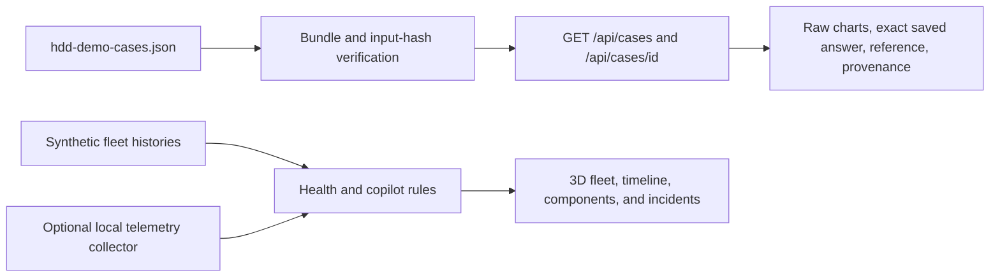

# Canary architecture

This document describes the implemented research system. The original hackathon design remains in Git history. Calibrated risk services, maintenance planning, and a live model-backed copilot remain future work.

## Data and model path

```mermaid
flowchart LR
    Source[Public source datasets] --> Audit[Source checksums and split assignment]
    Audit --> TimeF[Native TimeF shards and scoped windows]
    TimeF --> Input[Numerical channels and neutral text]
    TimeF --> Target[Weak pattern targets]
    Input --> Encoder[Temporal encoder]
    Encoder --> Projector[Embedding projector]
    Projector --> Gemma[Frozen Gemma with attention LoRA]
    Gemma --> Answer[Signal descriptions]
    Target --> Loss[Weighted answer-token loss]
    Answer --> Loss
    Loss --> Checkpoint[Validation-selected checkpoint]
    Checkpoint --> Test[Frozen test and numerical controls]
    Test --> Release[Predictions, metrics, hashes, and selected weights]
```

The HDD pipeline uses Backblaze records. The component adapters use their own source manifests and study designs. Dated studies separate device groups and time periods. Sound studies separate machines but retain unknown acquisition dates.

TimeNet writes native TimeF data. SDK read-back verifies observations, calendars, annotations, targets, and scoped inputs. Parquet shards provide streaming training access. The training bridge preserves the same numerical-input contract.

Each HDD input contains 28 consecutive daily observations and at least two complete SMART channels. Normalization uses only that observed window. Channel text includes the window's raw standard deviation. Targets, identifiers, dates, failure flags, and future observations do not enter the model prompt.

The model loader uses pinned Gemma 3 270M and OpenTSLM-SP assets from the local Hugging Face cache. Training updates the temporal encoder, projector, and rank-8 attention LoRA. Original Gemma parameters remain frozen. Each component starts from upstream weights.

The wrapper calculates loss only on answer tokens and uses left padding for generation. Completed-epoch validation selects the checkpoint. The evaluator freezes its hash and protocol before test release. Released test runs cannot train again.

## Browser applications

| Application | Entry point | Data and behavior |
| --- | --- | --- |
| Backblaze preview | `driftops demo` | Native TimeF training windows, raw charts, deterministic descriptions |
| Canary demo | `python3 driftops3d/server.py` | Saved real HDD evidence plus a separate synthetic 3D fleet |

The demo uses Python's standard-library HTTP server, vanilla JavaScript, and Three.js. It is intended for loopback use. There is no authentication or production hosting stack in this repository.

The evidence API reads three saved HDD cases. Missing or corrupt evidence returns HTTP 503. Unknown case identifiers return HTTP 404. Checkpoint hashes provide recorded provenance; the demo does not load or rehash model weights.

The fleet contains 147 illustrative devices. Its health scores, risk values, projections, and copilot responses come from rules. Historical and projected cutoffs disable the current-state copilot. The local telemetry collector does not invoke the trained component models.

## Code ownership

| Module | Responsibility |
| --- | --- |
| `acquire.py`, `full_archive.py`, `full_prepare.py` | Public-source acquisition, inventories, checksums, and row preparation |
| `timenet_connector.py`, `full_dataset.py`, component adapters | TimeF conversion, split boundaries, and scoped windows |
| `annotations.py`, `component_data.py` | Versioned weak labels and numerical inputs |
| `opentslm.py`, `_vendor/opentslm/` | Pinned model loading, input allowlist, tensor preparation, and generation |
| `train_full.py`, `component_training.py`, `training_config.py` | Run preparation, bounded training, and selected checkpoints |
| `evaluate_full.py`, `evaluate_component.py`, `evaluate_industrial.py` | Frozen protocols, baselines, numerical controls, and reload checks |
| `driftops3d/driftops/cases.py` | Saved-evidence integrity and response contract |
| `driftops3d/driftops/model.py`, `fleet.py`, `copilot.py` | Illustrative analysis, aggregation, and rule answers |
| `driftops3d/web/` | Browser navigation, charts, 3D scenes, and evidence view |

Core Python module paths are relative to `src/driftops/` unless a path is explicit.

## Verification and scope

`bash scripts/verify.sh` builds the bundled pilot, runs core and demo tests, and verifies released evidence hashes. `npm run test:browser` starts a temporary demo and checks four evidence-view sizes plus laptop/server navigation.

The benchmark measures agreement with rule-derived signal descriptions. It does not establish failure prediction, physical root cause, remaining life, or maintenance benefit. See [component results](component-model-results.md) and [reproduction](reproduction.md).
