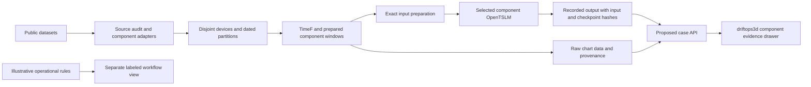

# DriftOps demo and presentation review

Reviewed September 13, 2026. The user confirmed that `driftops3d` is the only demo and that the presentation lasts five minutes.

Use the latest `driftops3d` as the product interface. Connect it to the existing data and model pipeline through a small, explicit adapter. Reuse the Backblaze preview's raw charts and provenance display. A second application or a second 3D implementation is unnecessary.

The main gap is evidence, not 3D design. The current demo shows synthetic telemetry and rule-generated predictions. Thirteen trained component models exist locally, but neither browser interface calls them.

## What was retrieved

GitHub `main` is at `6155189b10946db49f532be0f6dcf10df297d808`. The `driftops3d-frontend` branch is at `1e544380d0413d84271db4cc58c44b258c03f6a3` and already belongs to main's history. Main adds later navigation fixes, historical replay, SMART collection, and `PresentationDraftDeck.html`.

The latest files are in [the isolated checkout](../../../driftops3d/). The [source receipt](source.json) records both revisions. At review time, local main remained at `1d55830`. The review used an isolated checkout to preserve uncommitted training work. The later user-authorized upload merged this incoming revision and the training work.

| Existing part | Keep | Change for a model-backed demo |
| --- | --- | --- |
| `driftops3d/web/js/site-scene.js` | Rack navigation, selection, scanning animation | Add a clearly labeled virtual dataset lab. Physical placements remain illustrative. |
| `web/js/scene.js` | Server and laptop cutaways | Select the exact model from the component's data contract. Geometry alone cannot select a model. |
| `web/js/panel.js` | Component drawer, evidence list, signal plots | Lead with raw measurements and actual model text. Add source, date, model, and output-origin labels. |
| `web/js/timeline.js` | Replay controls and event navigation | Use source dates and the same cutoff everywhere. Suppress unsupported future forecasts for dataset cases. |
| `web/js/twin.js` | Fleet navigation and context panel | Add real-data cases and consistent provenance. Replace numeric risk with an unavailable state where no risk model exists. |
| `driftops3d/driftops/model.py` | An explicitly labeled illustrative rules mode | Keep rule scores separate from trained descriptions. Its hazard formula is not a learned probability model. |
| `src/driftops/preview.py` and `preview.html` | Raw 28-day charts, source identification, causal window boundary | Reuse their ideas and data contract inside the component drawer. Do not retain a separate user journey. |
| `src/driftops/opentslm.py` and training adapters | Pinned loader, exact input preparation, saved checkpoint reload | Add bounded inference behind the UI after the saved-output path works. |

## Recommended first integrated demo

Add a `Dataset lab` entry beside the illustrative sites. Its opening view contains a few virtual storage slots backed by real Backblaze windows. Label the placement `Virtual layout` and the measurements `Backblaze data`.

The shortest useful journey should require two selections: choose a case, then open its component evidence. Show the already computed result immediately. A separate `Run model` action can request fresh inference when that path is implemented.

The component drawer should show:

1. Dataset, device reference, absolute start date, cutoff date, and channel coverage.
2. Raw channel charts with verified units and missing-data markers.
3. The selected model's actual answer, labeled `Saved model output` or `Computed now`.
4. A short explanation of the observed change, with an evidence link to the chart.
5. An expandable model card with checkpoint identity, evaluation population, metrics, and limitations.

Use `Observed change` for a rising counter. Do not turn every rising value into a red failure alert. Stable observations also do not establish a healthy device.

Keep the synthetic site available for the maintenance-workflow concept. Its risk, confidence, correlations, and future projection need a visible `Illustrative rules` label near the affected output. A generic `Demo data` badge does not explain how the probability was produced.

For the main pitch, use one HDD case. The model catalog can expose the other components through an evidence selector. Building industrial 3D geometry is unnecessary for this five-minute demonstration.

## Real cases prepared for review

[hdd-demo-cases.json](../../../results/2026-09-13/hdd-demo-cases.json) contains three complete, 28-day cases, raw values, exact model inputs, saved outputs, input hashes, and checkpoint provenance. It is 25,092 bytes. It is not yet connected to the application.

| Case | Released test index | Observation period | What it demonstrates |
| --- | ---: | --- | --- |
| `hdd-rising` | 0 | November 26 to December 23, 2025 | SMART 197 rises from 0 to 8. The model says `rising`. SMART 194 fluctuates from 27 to 29. |
| `hdd-stable` | 76 | February 23 to March 22, 2026 | All four supplied channels remain constant. The model returns four constant descriptions. |
| `hdd-model_mismatch` | 52 | October 1 to October 28, 2025 | SMART 194 ranges from 36 to 47. The weak target says fluctuating, but the model says falling. |

These are the first released examples that match each stated illustration criterion. Selection happened after evaluation. They do not form a new benchmark, and their accuracy must not replace the complete test result.

The source test hash and selected checkpoint hash were checked again during this review. Every selected input matches its saved inference hash. Targets remain in a separate evaluation-reference field and must never enter inference requests.

The export lacks a verified device model and physical site or rack. Those fields are null. Enrich them from source metadata before using manufacturer-specific units or placing devices into a claimed real topology. The raw charts use `raw_source_units` until that mapping is verified.

## Integration contract

The following architecture is proposed. The data preparation and model boxes already exist. The case API and UI connection remain to be built.

Prefer one application backend and one Python package boundary. Currently, `src/driftops` and `driftops3d/driftops` use the same package name. `driftops3d/server.py` imports the latter because of its launch location. Adding `from driftops.opentslm import ...` there will not reliably select the training package.

A coherent implementation can move the demo domain modules beneath the existing application package and serve its web assets through one entry point. Another viable choice is a small local inference service with an explicit API. For this repository, one backend is simpler. Do not solve the collision with import-order tricks.

Proposed endpoints:

| Endpoint | Contract |
| --- | --- |
| `GET /api/models` | Approved component model IDs, scope, checkpoint hashes, benchmark metrics, and runtime availability. Failed experiments remain in the research report, not the default selector. |
| `GET /api/cases` | Small case index with component, source, date range, available outputs, and virtual placement. |
| `GET /api/cases/{id}` | Raw observations, chart metadata, saved output, and provenance. No server-local paths. |
| `POST /api/cases/{id}/infer` | Resolve the fixed case and permitted model on the server. Accept no target text or arbitrary checkpoint path. |

The response needs separate fields for `observations`, `model_interpretation`, `evaluation_reference`, and `operational_context`. Its risk fields should remain null until a separate risk model has suitable validation. Update the renderers as part of this contract change. Current code assumes values such as `risk_7d` and `failure_window.label` always exist.

Key cached results by dataset version, device, cutoff, channel set, preprocessing version, and checkpoint hash. A replay date must select the same window for charts, colors, summary text, and copilot answers. A current result cannot answer a historical request.

For a historical window without a saved output, show `No model result for this cutoff` or run inference on that exact window. Do not interpolate model prose or reuse an answer from a later date. Keep future failure outcomes outside the model input.

Load a permitted model once for fresh inference. Use a bounded queue and return explicit loading, timeout, invalid-output, and unavailable-model states. A cached fallback must retain its label. The current thread-per-request demo backend should not start unbounded model loads or concurrent adapter changes.

## Component and data mapping

| UI selection | Actual model and data | Display boundary |
| --- | --- | --- |
| HDD storage | Backblaze HDD SMART histories | 28 daily observations. Device-specific SMART interpretation still matters. |
| SSD storage | Separate Backblaze SSD model | Do not send SSD histories to the HDD checkpoint. |
| NVMe storage | Ceph device telemetry | Use its own channels, cadence, and preparation. No verified failure outcomes. |
| Memory | SMART-MEM recorded error histories | Zero logs means no recorded errors, not verified healthy exposure. |
| CPU | ClusterWise / Summit processor power and temperature | Datacenter processor signals do not validate consumer-laptop fault diagnoses. |
| GPU | Separate ClusterWise / Summit GPU power and temperature model | Keep node grouping and GPU channel identity. |
| Server power | ClusterWise / Summit power-supply inputs | Do not relabel this as a generic whole-server reliability model. |
| Fan | Marconi100 paired fan-rotor speeds | 28 fifteen-minute aggregates represent seven hours. Use interval-end availability. |
| Gearbox | Cubico SCADA oil temperatures | Separate industrial asset evidence, not a server component. |
| Generator bearing | Cubico SCADA bearing temperatures | Temperature interpretation, not a vibration fault classifier. |
| Gear-oil pump | Cubico SCADA oil pressures | Do not advertise generic water-pump coverage. |
| Slide rail and industrial valve | Separate MIMII sound models | 28 energy frames represent 0.896 seconds. Dates are unverified. Use clip offsets, not calendar dates. |
| Battery | No trained battery checkpoint | Keep illustrative, or show unsupported. |

Do not combine unrelated machines into an observed rack or infer cross-component correlations between different datasets. A virtual display can contain them if the synthetic placement is explicit. Each case must retain its own time scale.

The live collector is a separate path. A short benchmark cannot supply a 28-day HDD history. Common SMART column names do not establish compatible cadence, missingness, scale, or hardware coverage. Keep missing channels missing instead of filling them with zeros.

## Order of implementation

1. Bring incoming UI files into a working branch while preserving current training code and reconciling README and handoff changes.
2. Resolve the duplicate Python package name and define the case response contract.
3. Serve the three verified HDD cases and saved outputs. Connect them to the existing component drawer.
4. Correct replay consistency and unsupported risk rendering. Keep source labels visible.
5. Add fresh local inference for the selected case and measure its actual UI latency.
6. Expose other component models through their own adapters. Keep the main pitch centered on the HDD journey.
7. Update and rehearse the five-minute deck using the accompanying presentation plan.

Acceptance checks should cover one rising case, one stable case, and one mismatch. Verify saved-output provenance, a changed cutoff, a missing channel, unavailable weights, and model timeout. Confirm that targets cannot enter inference and that unknown risk never renders as zero risk. Test the main journey at desktop and mobile sizes. Use the existing navigation regression where its Chrome driver is available, then run the repository's relevant data tests and clean-checkout smoke workflow before claiming portability.

This review did not implement these changes. It launched local preview servers, inspected browser behavior, verified existing artifacts, and prepared review files. No new training, inference run, cloud provisioning, commit, or push occurred.

See [UI findings](ui-review.md), [the five-minute presentation plan](presentation-plan.md), and [measured metrics](../../../results/2026-09-13/measured-metrics.json).
