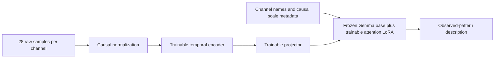

# Five-minute DriftOps presentation

Keep the draft's visual style. Replace its sixteen-slide main sequence with seven slides and a technical appendix. Show the product within the first twenty seconds. The current draft introduces it on slide nine and contains no completed model results.

The audience may assume this is a 3D monitoring mockup with a chatbot. They should leave understanding that separate small models can read numerical histories. The obstacle is proving that numerical input affects the answer, while explaining what the tests do not establish.

The defensible claim is: **DriftOps connects observed hardware changes to an inspection workflow. Its component models have passed defined signal-description tests.** Integration remains unfinished as of this review. Failure prediction and maintenance benefit remain unvalidated.

## Seven-slide sequence

These timings total 300 seconds. The demo sequence below is the target after the proposed case integration. Until that integration works, explicitly identify the 3D workflow as illustrative and present saved model results separately.

| Time | Takeaway headline | Visible content | Spoken explanation |
| --- | --- | --- | --- |
| 0:00 to 0:20 | **Hardware histories can show changes worth investigating.** | One raw signal chart and a small rack image. No outage-cost collage. | Introduce the operator problem: many channels, uncertain context, and limited inspection time. Avoid claiming every failure has a visible precursor. |
| 0:20 to 1:40 | **One component opens the measurements behind its explanation.** | The 3D component journey and the real HDD case. Show source, cutoff, raw values, and saved model output. | Open the rising case. SMART 197 goes from 0 to 8. The model describes that change. State that the rack placement is virtual. Briefly compare the stable case. |
| 1:40 to 2:25 | **The HDD model matched 99.68% of held-out signal labels.** | Three bars: trained model 99.68%, zeroed numerical input 86.01%, constant baseline 69.43%. Caption: 2,048 unseen drives, 6,777 channel answers, weak labels. | Explain the zero-input control and later test dates. State that accuracy measures signal descriptions, not failure prediction. The rules used to create labels score 100% by construction. |
| 2:25 to 3:10 | **We trained 2.93 million parameters in a 271 million-parameter model.** | A compact data-to-model diagram. Highlight trainable encoder, projector, and LoRA. Mark the Gemma base frozen. | Explain numerical patches, learned time-series tokens, and text generation. HDD training covered 11.32 million eligible windows on eight Nebius GPUs. |
| 3:10 to 3:45 | **Thirteen component models passed their declared description checks.** | Component names grouped by storage, compute, and industrial data. Keep the complete metric table in the appendix. | Each component has separate fitted weights and appropriate source data. Industrial tests have only five held-out groups. Sound recordings lack verified acquisition dates. |
| 3:45 to 4:30 | **The model still makes mistakes, and risk needs separate validation.** | The HDD mismatch: raw SMART 194 trace, model `falling`, reference `fluctuating`. A short measured-versus-unmeasured comparison. | Explain that rule agreement does not validate failure causes, warning time, or replacement decisions. Next, integrate the evidence view and test against useful independent labels. |
| 4:30 to 5:00 | **The next proof is a real operator pilot.** | Three deliverables: connected evidence view, expert assessment, outcome-based evaluation. | State what exists today and what the pilot must measure. Close on the inspection workflow and the next falsifiable test. |

Use a preselected case. Do not spend stage time searching 147 synthetic devices, starting a hardware benchmark, loading thirteen models, or explaining every source. Keep a recording or screenshots of the verified path as a fallback once it exists. Label saved output as saved output during the live demonstration.

## Exact model and data figures

[measured-metrics.json](../../../results/2026-09-13/measured-metrics.json) extracts these figures from the frozen artifacts. All fifteen metrics files matched their catalog hashes during this review. Numbers below use decimal MB for weight files and GiB for the historical archive sizes.

| Item | Figure to use | Qualification |
| --- | --- | --- |
| Backbone | Gemma 3 270M, OpenTSLM-SP | The actual audited model has 271,029,888 total parameters after temporal modules and LoRA. |
| Frozen parameters | 268,098,816 | Original language-model parameters. |
| Trainable parameters | 2,931,072, about 1.08% | Encoder 2,110,976, projector 82,816, attention LoRA 737,280. |
| LoRA configuration | Rank 8, alpha 16, q/k/v/o attention projections | Separate fitted state for each component. |
| Numerical input | 28 samples per channel | HDD samples are daily. Other components use different cadences. |
| Temporal encoder | Patch size 4, six transformer layers, width 128 | A 28-sample channel produces seven numerical patch tokens before projection. |
| Projection | 128 to Gemma's 640-dimensional embedding space | Numerical tokens join channel and instruction text. This is the SoftPrompt variant. |
| Backblaze source coverage | April 10, 2013 to March 31, 2026, 4,739 days | All 44 official archive files available in the completed acquisition. Say `through Q1 2026`. |
| Download size | 30.766 GiB compressed, 229.578 GiB dated CSV content | Historical source snapshot, not all component datasets combined. |
| Converted rows | 712,322,056 accepted source rows, 235,631 quarantined | Accepted rows include 706,533,780 HDD rows. SSD rows remain separate. |
| HDD training | 11,315,069 eligible training windows, 260,618 training devices | A complete pass over eligible windows, not every raw row. Input gaps, partition dates, failures, and coverage rules exclude rows. |
| HDD held-out test | 2,048 windows from 2,048 unseen drives | Drawn from the reserved test pool of 295,377 windows and 50,886 drives. |
| HDD channel accuracy | 99.6754%, rounded to 99.68% | 6,777 channel labels. Labels describe observed patterns. |
| HDD exact-window accuracy | 98.9258%, rounded to 98.93% | Every supplied channel must match for a window to count as exact. |
| HDD macro F1 | 0.9912 | Over supported classes. Counter-reset performance is not established by this selected test. |
| Valid HDD outputs | 100% | Required output format, not proof of physical correctness. |
| GPU evaluation speed | 2,048 windows in 179.54 seconds, about 11.41 windows/second | One comparison worker on one RTX PRO 6000. Batch size 16, up to 128 generated tokens. Generation time only. |
| GPU batch latency | Median 1.404 seconds, p95 about 1.494 seconds | Across 128 batches of 16. Do not label it single-user request latency. |
| Local CPU check | 7.70 seconds for HDD model load plus 16 generated answers | Eight CPU threads, cached files. HDD reproduced 16 of 16 saved GPU answers. Not a fresh-download or browser latency test. |
| HDD training duration | 9,804.57 seconds, about 2 hours 43 minutes | Includes the completed first pass and a small partial second pass before stop. The selected checkpoint is epoch one. |
| Training hardware | Eight RTX PRO 6000 Blackwell Server Edition GPUs | The later component runs used independent workers. Do not describe all thirteen as one joint model. |
| Selected checkpoint file | 682,889,851 bytes, about 683 MB | Current export includes embedding and output-head tensors in the LoRA state. It is larger than a minimal adapter. |
| Shared base weights | 536,223,056 bytes, about 536 MB | Required in addition to the selected checkpoint by the current loader. Code, tokenizer, and runtime are additional. |
| Total project cost | About $111.35 estimated at 07:29 UTC, September 13 | Ledger estimate through completed training and evaluation, not a current billing-console balance. |

The thirteen passing checkpoint files total about 8.88 GB before the shared base and runtime. The 2.93 million trainable parameters do not imply a three-megabyte deployment. A smaller adapter export is possible work to investigate, but its reload equivalence has not been measured.

The 96 GB GPU capacity is not the model's measured peak memory use. No verified UI p50/p95 latency, fresh-request GPU latency, tokens per second, peak inference memory, frame rate, requests per second, or production cost per request is available. Mark these unmeasured. They are suitable checks for the integration step.

## Data split slide for the appendix

| HDD partition | Eligible windows | Disjoint devices | Observation dates |
| --- | ---: | ---: | --- |
| Training | 11,315,069 | 260,618 | Through December 31, 2024 |
| Validation | 422,976 | 49,668 | January 1 to September 30, 2025 |
| Calibration reserve | 279,283 | 32,815 | January 1 to September 30, 2025 |
| Test reserve | 295,377 | 50,886 | October 1, 2025 to March 31, 2026 |

Device hashes assign each drive to one partition. Every input window must fit entirely inside its partition's date range. Validation selected the checkpoint before test release. Calibration devices are separate, but calibration shares the validation date interval and remains unused. Do not draw a timeline that implies calibration follows validation chronologically.

The displayed accuracy uses the frozen 2,048-drive sample of the test reserve, not all 295,377 test windows. The test has 4,705 constant, 1,130 fluctuating, 525 rising, and 417 falling channel labels. That class balance makes macro F1 and the numerical-input control important.

The model's raw channel accuracy improves by 13.66 percentage points over zeroed numerical inputs. The paired drive-mean accuracy gain has a 95% bootstrap interval of 13.18 to 14.64 percentage points. These use different averaging units, so keep the labels explicit.

## Component table for the appendix

All accuracy values below measure agreement with weak numerical-pattern labels. They are not comparable estimates of component failure detection. The source populations and channel mixes differ.

| Model | Held-out groups | Test windows | Channel accuracy | Macro F1 |
| --- | ---: | ---: | ---: | ---: |
| HDD | 2,048 | 2,048 | 99.68% | 0.9912 |
| SSD | 159 | 159 | 95.91% | 0.9512 |
| NVMe | 256 | 256 | 97.75% | 0.9443 |
| DRAM | 256 | 256 | 94.14% | 0.9195 |
| CPU | 256 | 256 | 81.45% | 0.7597 |
| GPU | 256 | 256 | 92.32% | 0.9047 |
| Server power | 256 | 256 | 83.01% | 0.8344 |
| Fan | 116 | 116 | 95.69% | 0.9651 |
| Gearbox | 5 | 1,280 | 86.91% | 0.8716 |
| Generator bearing | 5 | 1,280 | 93.20% | 0.9331 |
| Gear-oil pump | 5 | 1,280 | 82.11% | 0.8113 |
| Slide rail sound | 5 | 5,120 | 83.22% | 0.8324 |
| Industrial valve sound | 5 | 5,120 | 77.08% | 0.7579 |

Preserve the failed dated radiator-valve result in the appendix. Its original 95.10% accuracy did not pass the required changed-window support check. The unchanged-weight follow-up also failed the numerical-dependence gate despite 94.06% accuracy. The separate sound result does not repair either telemetry failure.

Sound models use separate training, validation, and test machines, but verified acquisition dates are unavailable. The user accepted this exception. They have no calibration partition. Their CC-BY-NC-SA-4.0 source terms and the DRAM source's noncommercial terms belong in the data appendix. Retain source attribution and review applicable terms before commercial reuse.

The five-group industrial studies have limited population support. Thousands of windows do not create thousands of independent machines. Do not pool all component scores into one product accuracy number.

## Architecture illustration

Use a single diagram with two parallel input paths:

Draw labels and future outcomes outside this inference diagram. Training labels supervise answer tokens during fitting. They are not inference inputs. Show a separate future box for risk calibration and operational recommendations.

Name the upstream checkpoint `OpenTSLM/gemma-3-270m-tsqa-sp`. The correct paper is [OpenTSLM, arXiv 2510.02410](https://arxiv.org/abs/2510.02410). The [official checkpoint card](https://huggingface.co/OpenTSLM/gemma-3-270m-tsqa-sp) identifies Gemma 3 270M and the SoftPrompt architecture. The draft's `2410.02897` reference is incorrect. Do not import the paper's medical benchmark scores into the hardware results.

## Edits to the existing draft

| Existing slides | Recommended treatment |
| --- | --- |
| 1, opening | Keep the visual style. Replace the universal drift-before-failure assertion with an observed-change claim. |
| 2 to 5, costs and outages | Remove from the five-minute main sequence. The software outage examples distract from the measured hardware task. Retained quantitative claims need exact primary citations and scope checks. |
| 6, competition | Remove `Prediction is solved` and the categorical claim that no tools prioritize work. Describe the proposed workflow difference without an unsupported market claim. |
| 7 to 8, hardware drift | Replace the universal claim with the real HDD trace. Put any sourced component statistics in an optional appendix. |
| 9, product | Move to the opening. |
| 10, architecture | Replace pilot counts with full-history coverage. Include LoRA, actual parameter counts, and the correct OpenTSLM citation. |
| 11, live demo | Show actual model text over real data once integrated. A synthetic 2-to-6-day forecast cannot serve as model evidence. |
| 12, priority | Keep only as a visibly illustrative operational concept in the appendix. Replace invented probabilities before presenting it as a result. |
| 13, status | Replace future-training bullets with completed tests and remaining integration and risk work. Include the failed radiator-valve result in the technical appendix. |
| 14, savings | Remove numerical savings from the main pitch. Neither maintenance savings nor avoided downtime has been measured. |
| 15, closing | State the operator pilot and its acceptance tests. Avoid claiming measured downtime prevention. |
| 16, sources | Keep as an appendix. Use direct links, dataset revisions, metric-file hashes, and precise denominators. |

Backblaze publishes daily drive snapshots and warns that its schema changes over time. Cite the [official dataset page](https://www.backblaze.com/cloud-storage/resources/hard-drive-test-data) for data provenance. Local manifests, not the public site's current summary statistics, support this experiment's counts.

## Questions to prepare for

**Why use a language model if rules create the targets?** This study verifies numerical interpretation and reproducible adaptation. The rule generator achieves 100% by construction. It does not show that a TSLM is better than rules for this task. The next useful test needs independent expert labels or a task that simple rules cannot already solve.

**Does 99.68% mean failure prediction works?** No. It measures four supported description classes on a fixed held-out HDD sample. Failure risk needs event labels, censoring-aware evaluation, calibration, false-alert rates, and useful warning-time measurements.

**Why separate models?** The datasets describe different channels and sampling intervals. Separate weights and contracts preserve those distinctions. The current evidence does not test whether a combined model would perform better or worse.

**Can this run locally?** Existing CPU checks demonstrate model load and inference. Most passing categories reproduced all sixteen saved GPU answers. CPU, GPU, and server-power component models reproduced fifteen of sixteen on CPU. Warm single-case latency and memory use still need measurement through the integrated API.

**What is actually live?** The 3D workflow currently uses synthetic data and rules. The trained checkpoints and frozen evaluation outputs are real. The proposed data adapter joins those parts. Label that boundary until it is implemented and tested.

**What would prove operational value?** First measure explanation correctness and operator task completion against a raw-chart baseline. For a later risk model, measure failure recall at a fixed alert budget, precision, calibration, warning time, and maintenance outcomes. No such measurements exist yet.
